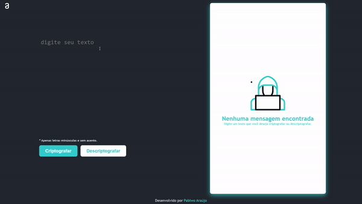

# challenge-decodificador-de-texto
## 🎌 Desafio do curso Iniciante em Programação T7 - ONE
Essa é uma aplicação que criptografa textos, assim é possível trocar mensagens secretas com outras pessoas que saibam o segredo da criptografia utilizada.

## 📌 Requisitos

- Deve funcionar apenas com letras minúsculas
- Não devem ser utilizados letras com acentos nem caracteres especiais
- Deve ser possível converter uma palavra para a versão criptografada e também retornar uma palavra criptografada para a versão original
- A página deve ter campos para inserção do texto a ser criptografado ou descriptografado, e a pessoa usuária deve poder escolher entre as duas opções
- O resultado deve ser exibido na tela.

Extra:
- Um botão que copie o texto criptografado/descriptografado para a área de transferência - ou seja, que tenha a mesma funcionalidade do ctrl+C ou da opção "copiar" do menu dos aplicativos.

## 💻 Preview
Demonstração | 
:-------------------------:|
 

## ⚙️ Tecnologias

 

## 🔑 Criptografia
As "chaves" de criptografia utilizadas foram:

Chave | Valor|
:-------------------------:|:-------------------------:|
**"e"**| **"enter"**|
**"i"**| **"imes"**|
**"a"**| **"ai"**|
**"o"**| **"ober"**|
**"u"**| **"ufat"**|

Exemplo: Para a palavra **"gato"**, a criptografia seria **"gaitober"**.

## 🌐 Disponível em
Voce pode testar o projeto aqui: [pablwoaraujo.github.io/challenge-decodificador-de-texto](https://pablwoaraujo.github.io/challenge-decodificador-de-texto/) 
